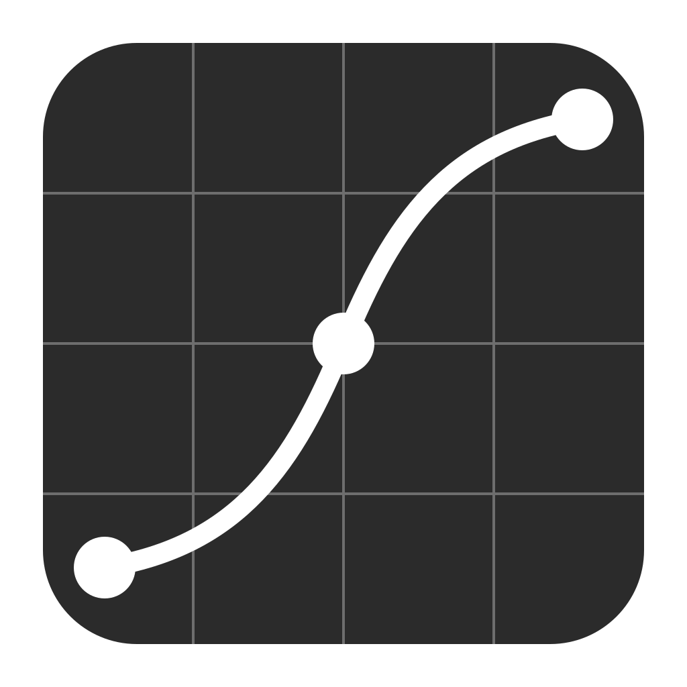
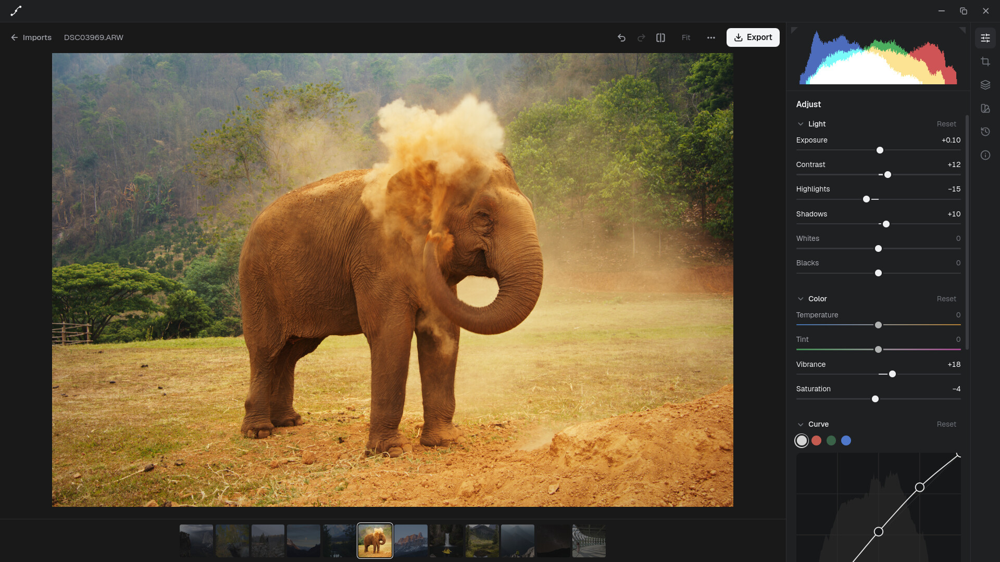
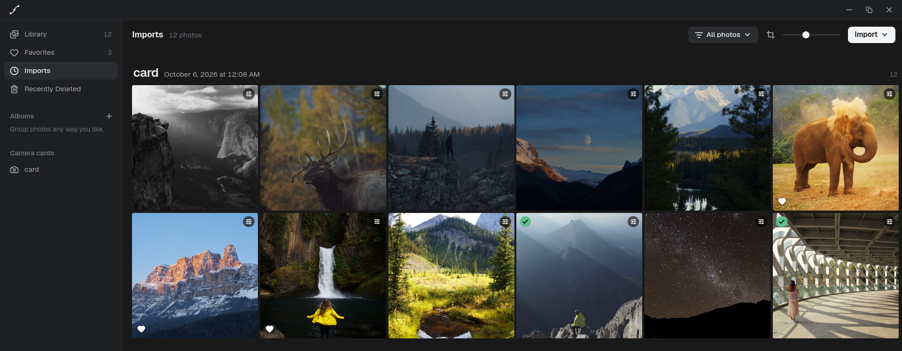
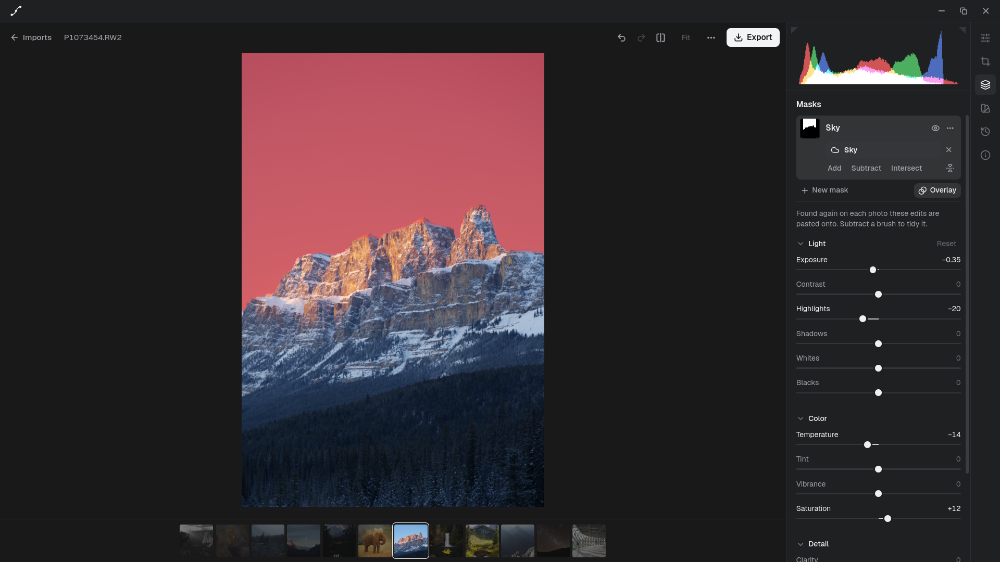
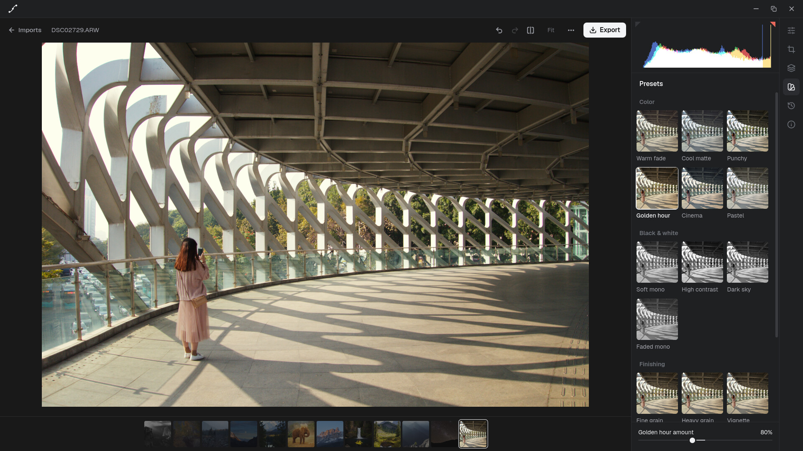

<p align="center">
  
</p>

<h1 align="center">Tonality</h1>

<p align="center">
  <strong>A RAW photo editor with a lot of power and nothing to learn first.</strong><br>
  Import, cull, edit and export your photos in one calm app. Free and open source.
</p>

<p align="center">
  <a href="#try-it">Try it</a> ·
  <a href="docs/guide.md">User guide</a> ·
  <a href="https://github.com/cobysmckinney/tonality/issues">Roadmap</a> ·
  <a href="CONTRIBUTING.md">Contribute</a>
</p>



---

Most RAW editors make you choose. The simple ones run out of road the moment you want to brighten a face or darken a sky. The powerful ones bury that power under hundreds of modules and a four-hour tutorial.

Tonality is built to be both. It gives you the tools serious photographers reach for: masks that find the subject and sky for you, tone curves, a colour mixer, presets, full edit history. It puts them behind an interface you can understand the first time you open it. Every control says what it does, the defaults are good, and the photo is the only colourful thing on the screen.

## Why Tonality

**Simple on the surface.** One slider does one thing, labelled in plain words. Tools sit in a single rail, and nothing opens in a floating window. Someone who has never edited a RAW can get a good result. Someone who has edited thousands won't run out of controls.

**Fast.** Your photo is developed on the graphics card at full resolution, and every slider redraws it at once. There are no preview proxies and no "rendering…" spinner.

**Smart masks, on your computer.** Click *Subject* or *Sky* and Tonality finds it. Draw a rough loop around anything else and it finds the outline. Small models bundled with the app do this on your own machine. Nothing is uploaded, ever.

**Your photos stay yours.** Tonality keeps one tidy library, filed by date, in a normal folder you can browse without the app. Originals are never changed: edits are stored as a recipe, and exports are new files. No account, no subscription, no cloud.

**Nothing is lost.** Every change is a step you can undo, even after a restart. Branch an edit to try two looks of the same photo and switch between them, like a small version history for each picture.

## What it does

### A library you don't have to manage



Import from a camera card, a folder or by dragging files in. You review what was found, grouped by day, before anything is copied. Duplicates are spotted and skipped, and RAW + JPEG pairs become one photo. Cull with single keys (`P` pick, `X` reject, `F` favorite), and organise with albums. Deleted photos wait 30 days in Recently Deleted.

### The edits you actually need

- **Light and colour**: exposure, contrast, highlights, shadows, whites, blacks, temperature, tint, vibrance, saturation.
- **Tone curve** with per-channel curves, and an **eight-band colour mixer**.
- **Detail and effects**: clarity, dehaze, sharpening, noise reduction, vignette, grain.
- **Crop and straighten**, with common ratios, quarter-turns and flips.
- **A good starting point**: RAW files open with a look matched to your camera's own JPEGs, not a flat grey negative.
- **Histogram with clipping warnings**.
- **Before and after** on a split you can drag, against the original or any earlier step in the history.

### Masks without the fiddling



Change one part of the photo: brighten a face, deepen a sky, warm a background. Start a mask from the **subject**, **background**, **sky**, an **object** you circle, a **brush**, a **linear or radial gradient**, or a **brightness range**. Masks can be combined ("the sky, minus the subject"), they follow your crop, and when you paste edits onto other photos each one finds its own subject and sky.

### Presets that respect your work



Every preset is previewed on your own photo before you apply it. A preset only changes what it's about, so a colour look keeps the exposure you already fixed, and a grain preset stacks on top. Fade any preset from 0% to 200%, save your own, and share them as small files.

### Export without surprises

Before anything is written, the export sheet shows the exact file names and pixel sizes. Export JPEG, PNG or 16-bit TIFF, at full size or a longest side you choose. Nothing is ever overwritten.

Everything is described in detail in the **[user guide](docs/guide.md)**.

## Try it

Tonality is **early**. It edits real photos well, but expect rough edges, and keep backups of anything precious. It is developed on Linux. macOS and Windows builds should work through Tauri but haven't been tried yet, and there are no downloadable installers yet. For now you build it from source:

```sh
git clone https://github.com/cobysmckinney/tonality.git
cd tonality
bun install
bun run tauri dev
```

You'll need [Rust](https://rustup.rs), [Bun](https://bun.sh), the [Tauri prerequisites](https://tauri.app/start/prerequisites/) for your system, and `libheif` for HEIC photos. To leave HEIC out, build with `--no-default-features`. Your library is created at `~/Pictures/Tonality`.

**Opens**: RAW files from most cameras (through [rawler](https://github.com/dnglab/dnglab)), DNG, JPEG, PNG, TIFF, WebP and HEIC.

## Help build it

Tonality is one person's project and it wants to be more. If you're a photographer, a Rust or React developer, a designer, or someone who knows colour science, there's room for you. Ways to help:

- **Use it and report what breaks.** Bug reports with a sample file are gold.
- **Pick up an issue.** The [issue list](https://github.com/cobysmckinney/tonality/issues) is the roadmap. Issues labelled [`good first issue`](https://github.com/cobysmckinney/tonality/labels/good%20first%20issue) are a gentle way in.
- **Bring expertise.** Colour management, highlight recovery, demosaicing, packaging for macOS and Windows, and accessibility all have open issues.

Start with **[CONTRIBUTING.md](CONTRIBUTING.md)**. Everyone taking part is asked to follow the [Code of Conduct](CODE_OF_CONDUCT.md).

## Licence

Tonality is free software under the [GNU General Public License v3.0 or later](LICENSE). The bundled segmentation models have their own permissive licences, listed in [`src-tauri/models/README.md`](src-tauri/models/README.md).

The photos in the screenshots are by [Ryan Breitkreutz](https://www.instagram.com/ryanbreitkreutz/), [Wut Kai Cheung](https://www.instagram.com/wutkaicheung_/) and Signature Edits, from [Signature Edits' free RAW photos](https://www.signatureedits.com/free-raw-photos/).
